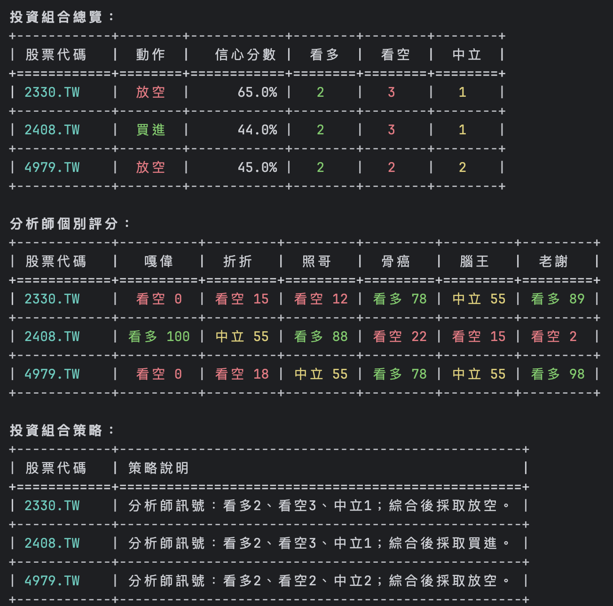

# AI 對沖基金（台灣分析師版）

本專案以 https://github.com/virattt/ai-hedge-fund 為基礎進行改寫與在地化調整。  
(This project is adapted and localized from https://github.com/virattt/ai-hedge-fund.)

這是一個用於**教學與研究**的多代理（Multi-Agent）交易決策專案。  
系統不會自動下單到券商，僅輸出策略建議與回測結果。



## 免責聲明

- 本專案僅供學習與研究，不構成任何投資建議
- 不保證績效，使用者需自行承擔風險
- 歷史績效不代表未來結果

## 專案特色

- 多位分析代理共同評估同一檔股票
- 風險管理代理依波動度與相關性控制部位
- 投資組合經理整合訊號後輸出最終動作（買進/賣出/放空/回補/持有）
- 支援 CLI 即時決策與回測
- 支援 OpenAI / Anthropic / Groq / DeepSeek / Ollama 等模型來源
- 預設使用 **yfinance** 取得市場資料（不需 `FINANCIAL_DATASETS_API_KEY`）

## 代理清單（目前版本）

- 嘎偉（`airforce`）：偏空風險與估值派
- 折折（`discount`）：成長趨勢派
- 照哥（`huang`）：基本面體質派
- 骨癌（`cancer`）：技術面節奏派
- 腦王（`wang`）：情緒與籌碼派
- 老謝（`hindsight`）：新聞與敘事派
- 風險管理代理（`risk_management_agent`）
- 投資組合經理（`portfolio_manager`）

## 安裝與環境設定

### 1. 下載專案

```bash
git clone https://github.com/KuolungCheng/ai-hedge-fund-tw.git
cd ai-hedge-fund-tw
```

### 2. Python 版本需求

- 本專案建議使用 **Python 3.12 版本**
- 若尚未安裝 Poetry，請先依官方文件安裝：<https://python-poetry.org/docs/#installation>

```bash
poetry env use python
```

### 3. 安裝依賴


```bash
poetry install
```

### 4. 設定 `.env`

```bash
cp .env.example .env
```

至少設定一組 LLM 金鑰（擇一即可）：

```bash
OPENAI_API_KEY=your_openai_key
# 或
ANTHROPIC_API_KEY=your_anthropic_key
# 或
GROQ_API_KEY=your_groq_key
# 或
DEEPSEEK_API_KEY=your_deepseek_key
# 或其他 API Key
```

## CLI 使用方式

### 即時決策（主程式）

```bash
poetry run python -m src.main --tickers 2330.TW,6515.TW
```

常用參數範例：

```bash
# 指定模型
poetry run python -m src.main --tickers 2330.TW,6515.TW --model gpt-4.1

# 使用全部分析師
poetry run python -m src.main --tickers 2330.TW,6515.TW --analysts all

# 指定部分分析師
poetry run python -m src.main --tickers 2330.TW,6515.TW --analysts airforce,discount,huang

# 指定分析區間
poetry run python -m src.main --tickers 2330.TW,6515.TW --start-date 2025-01-01 --end-date 2025-03-31

# 調整風險管理基準部位上限（預設 0.2）
poetry run python -m src.main --tickers 2330.TW,6515.TW --base-position-limit 0.15
```

## 專案結構（精簡）

```text
src/
  agents/         # 分析代理、風險管理、投資組合經理
  backtesting/    # 回測引擎
  cli/            # CLI 參數與互動輸入
  tools/          # 資料來源整合（含 yfinance）
v2/               # 新架構實驗區（尚未整合至主流程）
```

## 授權

本專案使用 MIT License，詳見 `LICENSE`。
